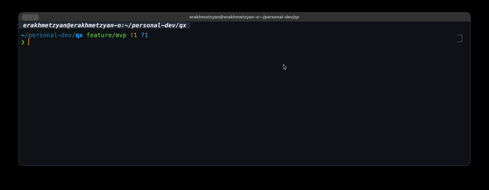

# qx

[](https://github.com/evgfitil/qx/actions/workflows/ci.yml)
[](https://codecov.io/gh/evgfitil/qx)
[](https://goreportcard.com/report/github.com/evgfitil/qx)

Generate shell commands from natural language using LLM.



## Features

- Natural language to shell command conversion
- Multiple command variants with fuzzy selection
- Interactive TUI with real-time filtering
- Optional post-selection action menu: execute, copy to clipboard, or revise with follow-up
- Pipe command output as context for precise command generation
- Shell integration (Ctrl+G hotkey) for Bash, Zsh, and Fish with inline editing support
- Command history with `--last`, `--history`, and `--continue` for follow-up refinement
- Support for OpenAI-compatible APIs

## Installation

### Homebrew (macOS/Linux)

```bash
brew install evgfitil/tap/qx
```

### From releases

```bash
curl -sSL https://github.com/evgfitil/qx/releases/latest/download/qx_$(uname -s)_$(uname -m).tar.gz | tar xz
sudo mv qx /usr/local/bin/
```

### From source

```bash
go install github.com/evgfitil/qx@latest
```

## Configuration

Create `~/.config/qx/config.yaml`:

```yaml
llm:
  base_url: "https://api.openai.com/v1"  # or any OpenAI-compatible API
  model: "gpt-4o-mini"
  count: 3  # how many commands to suggest
  apikey: "your-key-here"  # optional, can use env variable instead
```

**API Key**: Set via `OPENAI_API_KEY` environment variable or `llm.apikey` in config.
Environment variable takes precedence if both are set.

### Theme

Customize the TUI appearance with an optional `theme` section (all fields have fzf-like defaults):

```yaml
theme:
  prompt: "> "           # input prompt prefix
  pointer: "▌"           # cursor indicator for selected item
  selected_fg: "170"     # ANSI color or hex (#ff87d7)
  match_fg: "205"        # input prompt color
  text_fg: "252"         # normal text color
  muted_fg: "241"        # counter and spinner text
  border: "rounded"      # rounded | normal | thick | hidden
  border_fg: "240"       # border color
```

### Action menu

Control whether the post-selection action menu appears after command selection.
When disabled (default), the selected command is printed to stdout.
The `--history` subcommand always shows the action menu:

```yaml
action_menu: false  # default: false
```

```bash
# Option 1: environment variable
export OPENAI_API_KEY="your-key-here"

# Option 2: set apikey in config.yaml (see above)
```

## Usage

### Shell integration (Recommended)

Add the appropriate line to your shell configuration:

```bash
# Bash (~/.bashrc)
eval "$(qx --shell-integration bash)"

# Zsh (~/.zshrc)
eval "$(qx --shell-integration zsh)"

# Fish (~/.config/fish/config.fish)
qx --shell-integration fish | source
```

Reload your shell config and press Ctrl+G to invoke qx.

**Inline editing**: Start typing a command, press Ctrl+G, and qx will use your
input as initial query. Add instructions to modify or extend the command.

**Prompt restoration**: Press Esc to cancel selection and restore your query
to the command line for editing.

**Error display**: If qx encounters an error (invalid configuration, API failure, etc.),
the error message is displayed in the terminal. Normal cancellation via Esc does not
produce error output.

### Direct mode

```bash
qx "find all go files modified today"
```

### Interactive mode

```bash
qx
# Type your query, press Enter, select command
```

### Pre-filled query

```bash
qx --query "git log"
# TUI opens with input field pre-filled
```

### Pipe mode

Pipe command output into qx to provide context for more precise generation:

```bash
ls -la | qx "delete files larger than 1GB"
docker ps | qx "stop all nginx containers"
git branch | qx "delete all merged branches"
```

Pipe mode also works with interactive TUI:

```bash
kubectl get pods | qx
# Type your query in the TUI with pod list as context
```

Stdin input is limited to 64KB. Content is checked for secrets before being sent to the LLM.

### History and follow-up

Show the last selected command (action menu appears if enabled in config):

```bash
qx --last    # or: qx -l
```

Browse past queries with an interactive fuzzy picker:

```bash
qx --history
```

Refine the last command with a follow-up query:

```bash
qx --continue "make it recursive"    # or: qx -c "make it recursive"
qx --continue "add verbose output"
```

`--continue` also works with pipe context:

```bash
ls -la | qx --continue "only show directories"
```

History is stored in `~/.config/qx/history.json` and keeps the last 100 entries.

### Post-selection actions

By default, the selected command is printed to stdout. To enable the interactive
action menu, set `action_menu: true` in your config (see [Action menu](#action-menu)).

When the action menu is enabled and a TTY is available (stdout in direct mode,
or stderr in shell integration mode), it appears after selection:

```text
  docker stop $(docker ps -q --filter ancestor=nginx)

  [e]xecute  [c]opy  [r]evise  [q]uit
```

- `e` - execute the command in a subprocess
- `c` - copy to clipboard
- `r` - revise the command with a follow-up refinement query
- `q` or Enter - print to stdout
- Esc or Ctrl+C - cancel without any action

Revise lets you iteratively refine commands without leaving the flow.
Press `r`, type a refinement (e.g., "make it recursive"), and qx generates
new variants using the previous command as context.

## License

MIT
